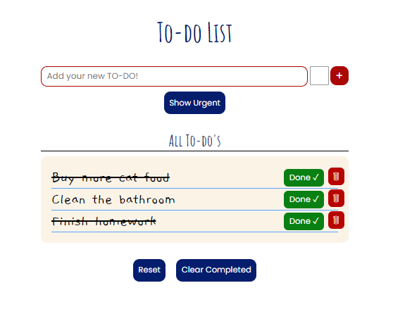

# To-Do List Application

This is a simple To-Do List application that helps you manage your tasks. It provides various features to organize and streamline your daily tasks.

## Deployed Site

- Access the To-Do List application by visiting the [deployed site](https://rizmiya-todo-list.surge.sh).

## Features

### Adding To-Dos
- You can easily add new tasks to your to-do list by typing them into the input field and clicking "+" button.

### Urgent To-Dos
- Mark a task as "Urgent" to prioritize it. Urgent tasks will appear at the top of the to-do list, making them easy to find and complete.

### Filtering To-Dos
- Use the "Show Urgent" button to display only urgent tasks, helping you focus on critical items.
- The "Show All" button allows you to view all tasks, whether urgent or not.

### Marking as Completed
- When you've finished a task, simply click on "Done" to mark it as completed. A strikethrough will appear to indicate that the task is done.

### Clear Completed Tasks
- If you want to declutter your list and remove completed tasks, click the "Clear Completed" button.

### Individual Task Actions
- Each task has a "Remove" button, allowing you to delete a task individually when it's no longer needed.

### Reset All Tasks
- The "Reset" button allows you to remove all tasks from your list, giving you a fresh start.

## Screenshot

