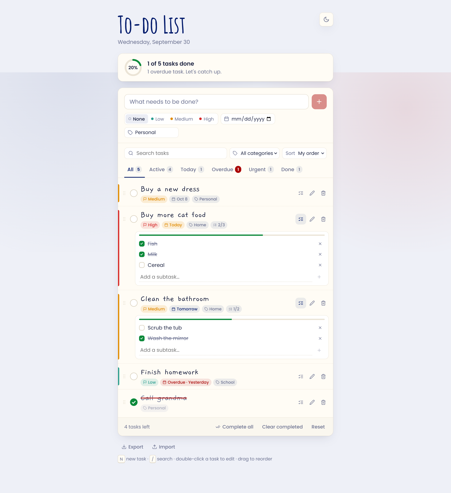

# To-Do List Application

A friendly, fast to-do list built with React. Your tasks are saved in your browser, so they're still there when you come back.

## Deployed Site

- Access the To-Do List application by visiting the [deployed site](https://rizmiya-todo-list.surge.sh).

## Features

### Tasks
- **Add tasks** by typing and pressing <kbd>Enter</kbd> (or clicking **+**).
- **Priorities**: None, Low, Medium, High. High-priority tasks show up in the **Urgent** view, and each task has a coloured priority stripe.
- **Due dates** with friendly labels (Today, Tomorrow, Friday, …). Overdue tasks are highlighted.
- **Categories**: tag tasks (e.g. Home, School) and filter by category. Existing categories are suggested as you type.
- **Subtasks**: break a task into a checklist with its own progress bar.
- **Inline editing**: double-click a task (or use the ✏️ button) to change its text, priority, due date or category. <kbd>Esc</kbd> cancels.
- **Mark as done / undo**: click the circle to toggle a task.

### Organising
- **Views**: All, Active, Today, Overdue, Urgent and Done, each with a live count.
- **Search** across task text, categories and subtasks, with matches highlighted.
- **Sorting**: your own order, due date, priority, newest or A → Z. Completed tasks always sink to the bottom.
- **Drag and drop** tasks to reorder them (when sorting by "My order").

### Bulk actions & safety
- **Complete all** visible tasks, **Clear completed**, or **Reset** the whole list.
- **Undo**: deletes, clears, resets and imports can all be undone from the pop-up.

### Everything else
- **Progress ring** showing how much of your list is done.
- **Saved automatically** in `localStorage`, and kept in sync across open tabs.
- **Dark mode** that follows your system setting and can be toggled.
- **Export / Import** your tasks as a JSON file (for backups or moving between browsers).
- **Keyboard shortcuts**: <kbd>N</kbd> focuses the new-task box, <kbd>/</kbd> focuses search.
- **Responsive** layout that works on phones.

## Getting Started

```bash
yarn install
yarn start      # run the dev server at http://localhost:3000
yarn test       # run the test suite
yarn build      # production build in ./build
```

## Screenshot


